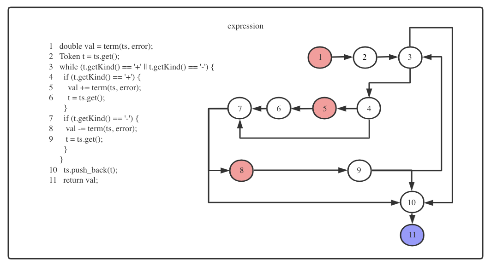

## 数据流测试

数据流测试是针对数据内容进行测试的测试方法，因此个人认为应该分为全局变量和局部变量分别测试。

在计算器代码中，TokenStream和Error类是每个计算唯一的,同时每个计算部分的val是连续的流，分析的时候应该改着眼于全局的数据流图，而函数内部变量如token只需要在函数级别进行跟踪，画出数据流图。

数据流图可以使用processon进行绘制。


##### 测试代码

```java
public class HandlerFunction implements FunctionHanlder {
  @Override
  public double single(Token_Stream ts, Error error) {
    double val = primary(ts, error);
    Token token = ts.get();
    if (token.getKind() == '!') {
      int tempValue = (int) val;
      if (tempValue == val) {
        int a = (int) val;
        val = fac(a);
        return val;
      } else {
        error.setError(4);
      }
    } else {
      ts.push_back(token);
    }
    return val;
  }

  @Override
  public double term(Token_Stream ts, Error error) {
    double val = single(ts, error);
    while (true) {
      Token token = ts.get();
      switch (token.getKind()) {
        case '*':
          val *= single(ts, error);
          break;
        case '/':
          double a;
          a = single(ts, error);
          if (a == 0) {
            error.setError(1);
          } else
            val /= a;
          break;
        case '%':
          double b;
          b = single(ts, error);
          if (val != (int) val || b != (int) b) {
            error.setError(2);
          } else if (b == 0) {
            error.setError(3);
          } else {
            int c = (int) val;
            int d = (int) b;
            val = c % d;
          }
          break;
        default:
          ts.push_back(token);
          return val;
      }
    }
  }

  @Override
  public double expression(Token_Stream ts, Error error) {
    double val = term(ts, error);
    Token t = ts.get();
    while (t.getKind() == '+' || t.getKind() == '-') {
      if (t.getKind() == '+') {
        val += term(ts, error);
        t = ts.get();
      }
      if (t.getKind() == '-') {
        val -= term(ts, error);
        t = ts.get();
      }
    }
    ts.push_back(t);
    return val;
  }

  @Override
  public double primary(Token_Stream ts, Error error) {
    Token token = ts.get();
    double val = 0;
    switch (token.getKind()) {
      case '8':
        val = token.getValue();
        break;
      case '(':
        val = expression(ts, error);
        token = ts.get();
        if (token.getKind() != ')') {
          error.setError(5);
        }
        break;
      case '+':
        val = primary(ts, error);
        break;
      case '-':
        val = -primary(ts, error);
        break;
      default:
        error.setError(6);
    }
    return val;
  }

  @Override
  public int fac(int val) {
    if (val == 0) {
      return 1;
    } else {
      int a = Math.abs(val);
      return val * fac(a - 1);
    }
  }
}
```


#### 针对ts变量

##### def/use图

| 函数       | def行数      | use行数           |
| ---------- | ------------ | ----------------- |
| main       | 3            | 6                 |
| expression | 2, 6, 10, 13 | 1, 2, 5, 6, 9, 10 |
| term       | 3, 20        | 1, 3, 6, 10, 18   |
| single     | 2, 13        | 1, 2              |
| primary    | 1, 9         | 1, 8, 9, 15, 18   |


#### 针对value变量

##### def/use图

| 函数       | def行数      | use行数        |
| :--------- | ------------ | -------------- |
| primary    | 2,5,8,14,17  | 21             |
| expression | 1,5,8        | 11             |
| term       | 1,6,14,19,26 | 19, 24,30      |
| single     | 1,7          | 4, 5, 6, 8, 13 |
| value      | 1            | 2,5,6          |

* value变量在primary函数中（红色代表定义节点，紫色代表使用节点，绿色表示定义/使用节点）

##### 数据流图


##### 路径

| 定义节点 | 使用节点 | 路径                    |
| -------- | -------- | ----------------------- |
| 2        | 21       | <2,3,7,8,9,10,11,12,21> |
| 5        | 21       | <5, 6, 21>              |
| 8        | 21       | <8, 9, 10, 11, 12, 21>  |
| 14       | 21       | <14, 15, 21>            |
| 17       | 21       | <17, 18, 21>            |


| 测试用例                              | 测试路径                            | 期望结果 |
| ------------------------------------- | ----------------------------------- | -------- |
| new TokenStream("5"), new Error()     | <2,3,7,8,9,10,11,12,21>, <5, 6, 21> | 5        |
| new TokenStream("(1+1)"), new Error() | <8, 9, 10, 11, 12, 21>              | 2        |
| new TokenStream("+1"), new Error()    | <14, 15, 21>                        | 1        |
| new TokenStream("-1"), new Error      | <17, 18, 21>                        | -1       |


* value变量在expression函数中（红色代表定义节点，紫色代表使用节点，绿色表示定义/使用节点）

##### 数据流图



##### 路径

| 定义节点 | 使用节点 | 路径                      |
| -------- | -------- | ------------------------- |
| 1        | 11       | <1,2,3,4,5,6,7,8,9,10,11> |
| 5        | 11       | <5, 6,10,11>              |
| 8        | 11       | <8, 9, 10, 11>            |


| 测试样例                            | 测试路径                               | 期望结果 |
| ----------------------------------- | -------------------------------------- | -------- |
| new TokenStream("1+1"), new Error() | <1,2,3,4,5,6,7,8,9,10,11>,<5, 6,10,11> | 2        |
| new TokenStream("1-1"), new Error() | <8, 9, 10, 11>                         | 0        |


* value变量在term函数中（红色代表定义节点，紫色代表使用节点，绿色表示定义/使用节点）

##### 数据流图


##### 路径

| 定义节点 | 使用节点 | 路径                               |
| -------- | -------- | ---------------------------------- |
| 1        | 19       | <1, 2, 3, 4, 16,17,18,19>          |
| 1        | 24       | <1,2,3,4,16,17,18,19,23,24>        |
| 1        | 30       | <1,2,3,4,28,29,30>                 |
| 6        | 19       | <6,7,2,3,4,16,17,18,19>            |
| 6        | 24       | <6,7,2,3,4,16,17,18,19,23,24>      |
| 6        | 30       | <6,7,2,3,4,28,29,30>               |
| 14       | 19       | <14,15,2,3,4,16,17,18,19>          |
| 14       | 24       | <14, 15, 2,3,4,16,17,18,19,23,24>  |
| 14       | 30       | <14,15,2,3,4,28,29,30>             |
| 19       | 24       | <19,20,27,2,3,4,16,17,18,19,23,24> |
| 19       | 30       | <19,20,27,2,3,4,28,29,30>          |
| 26       | 19       | <26,27,2,3,4,16,17,18,19>          |
| 26       | 24       | <26, 27,2,3,4,16,17,18,19,23,24>   |
| 26       | 30       | <26,27,2,3,4,28,29,30>             |


| 测试样例                              | 测试路径                                                     | 期望结果 |
| ------------------------------------- | ------------------------------------------------------------ | -------- |
| new TokenStream("1*1"), new Error()   | <1,2, 3, 4, 16,17,18,19>, <1,2,3,4,28,29,30>,<6,7,2,3,4,28,29,30> | 1        |
| new TokenStream("1%2"), new Error()   | <1,2,3,4,16,17,18,19,23,24>,<1, 2, 3, 4, 16,17,18,19>, <19,20,27,2,3,4,16,17,18,19,23,24>, <19,20,27,2,3,4,28,29,30>，<26,27,2,3,4,28,29,30> | 1        |
| new TokenStream("1*2%3"), new Error() | <6,7,2,3,4,16,17,18,19>, <6,7,2,3,4,16,17,18,19,23,24>,      | 2        |
| new TokenStream("1+1"), new Error()   | <1,2,3,4,28,29,30>                                           | 1        |
| new TokenStream("6/3%3"), new Error() | <14,15,2,3,4,16,17,18,19>， <14, 15, 2,3,4,16,17,18,19,23,24> | 2        |
| new TokenStream("6/3"), new Error()   | <14,15,2,3,4,28,29,30>                                       | 2        |
| new TokenStream("3%4%2")              | <26,27,2,3,4,16,17,18,19>, <26, 27,2,3,4,16,17,18,19,23,24>  | 1        |


* value变量在single函数中

##### 数据流图


##### 路径

| 定义节点 | 使用节点 | 路径              |
| -------- | -------- | ----------------- |
| 1        | 4        | <1,2,3,4>         |
| 1        | 5        | <1,2,3,4,5>       |
| 1        | 6        | <1,2,3,4,5,6>     |
| 1        | 8        | <1,2,3,4,5,6,7,8> |
| 1        | 13       | <1,2,3,11,12,13>  |
| 7        | 8        | <7,8>             |


| 测试用例              | 测试路径                                                     | 期望结果 |
| --------------------- | ------------------------------------------------------------ | -------- |
| new TokenStream("3!") | <1,2,3,4>,<1,2,3,4,5>, <1,2,3,4,5,6>, <1,2,3,4,5,6,7,8>, <7, 9> | 6        |
| new TokenStream("3")  | <1,2,3,11,12,13>                                             | 3        |


* value变量在fac函数中

| 定义节点 | 使用节点 | 路径      |
| -------- | -------- | --------- |
| 1        | 2        | 1,2       |
| 1        | 5        | 1,2,4,5   |
| 1        | 6        | 1,2,4,5,6 |


| 测试用例 | 测试路径                      | 期望结果 |
| -------- | ----------------------------- | -------- |
| fac(3)   | <1,2>, <1,2,4,5>, <1,2,4,5,6> | 6        |


#### 针对token变量

| 函数       | 定义节点 | 使用节点    |
| ---------- | -------- | ----------- |
| expression | 2，6，9  | 3，4，7，10 |
| term       | 3        | 4, 29       |
| single     | 2        | 3, 12       |
| primary    | 1,9      | 3,5,10      |


* token变量在expression函数中

##### 数据流图


##### 路径

| 定义节点 | 使用节点 | 路径          |
| -------- | -------- | ------------- |
| 2        | 3        | <2,3>         |
| 2        | 4        | <2,3,4>       |
| 2        | 7        | <2,3,4,5,6,7> |
| 2        | 10       | <2,3,10>      |
| 6        | 7        | <6,7>         |
| 6        | 10       | <6,7,8,9,10>  |
| 9        | 10       | <9, 10>       |


| 测试样例                            | 测试路径                                         | 期望结果 |
| ----------------------------------- | ------------------------------------------------ | -------- |
| new TokenStream("1+1"), new Error() | <2,3>，<2,3,4>，<2,3,4,5,6,7>,<6,7>,<6,7,8,9,10> | 2        |
| new TokenStream("1*1"), new Error() | <2,3,10>                                         | 1        |
| new TokenStream("1-1"), new Error() | <9,10>                                           | 1        |


* token变量在term函数中

##### 数据流图


##### 路径

| 定义节点 | 使用节点 | 路径        |
| -------- | -------- | ----------- |
| 3        | 4        | <3,4>       |
| 3        | 29       | <3,4,28,29> |


| 测试用例                          | 测试路径           | 期望结果 |
| --------------------------------- | ------------------ | -------- |
| new TokenStream("1"), new Error() | <3,4>, <3,4,28,29> | 1        |


* token变量在single函数中

##### 数据流图


##### 路径

| 定义节点 | 使用节点 | 路径        |
| -------- | -------- | ----------- |
| 2        | 3        | <2,3>       |
| 2        | 12       | <2,3,11,12> |


| 测试用例                          | 测试路径          | 期望结果 |
| --------------------------------- | ----------------- | -------- |
| new TokenStream("1"), new Error() | <2,3>,<2,3,11,12> | 1        |


* token变量在primary函数中

##### 数据流图


##### 路径

| 定义节点 | 使用节点 | 路径             |
| -------- | -------- | ---------------- |
| 1        | 3        | <1,2,3>          |
| 1        | 5        | <1,2,3,4,5>      |
| 1        | 10       | <1,2,3,7,8,9,10> |
| 9        | 10       | <9,10>           |


| 测试用例                            | 测试路径                | 期望结果 |
| ----------------------------------- | ----------------------- | -------- |
| new TokenStream("1"), new Error()   | <1,2,3>， <1,2,3,4,5>   | 1        |
| new TokenStream("(1+1)"), new Error | <1,2,3,7,8,9,10>,<9,10> | 2        |


#### 覆盖指标

这里采用了全使用的覆盖指标，包括从每个定义节点到所有谓词使用的定义清除路径